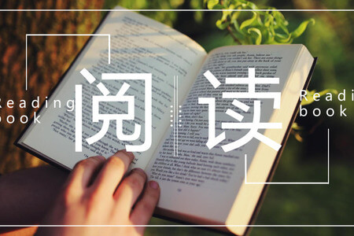

# 扩展视野相关信息

## 万丈高楼 起于垒土

> 基础对于每个人都是很重要的一步。

就前端而言，**OS、数据结构与算法、网络** 这几块内容是必须要掌握的基础的，这些基础不扎实，你的天花板势必不高。

在面试的过程中，发现大部分人问基础知识点还是能够说出来的，**但是仅限于知道 不行**。对于如何将多个知识点串联起来或者知识点的更深层次的问题就很少有人能够答好。

打个比方，跨域这种问烂的问题想必大家都能答出点东西。这个也是我常会问的一个问题，当然我还会配合几个问题去问。比如问什么浏览器要引入跨域这个机制；跨域请求到底有没有正常发出去并收到响应；是否了解跨域预检。对于以上三个问题，能够答出的人并不多，更多人只是知道我该如何去解决跨域，但是对于为什么要有跨域反而知道的并不多。这也侧面反应了大部分人并没有深入挖掘知识的意识，只是停留于表面。

- 夯实自己的基础，基础决定了大楼的高度
- 有深入挖掘知识的思想，对于每个知识点都应该考虑一下这玩意怎么实现的，为什么要有这玩意
- 不要做框架 API 的熟练工，尽量去了解框架底层的原理机制

如果你能做到以上几点，你差不多就领先百分之 90 的人.

## 拿得起，放得下，想得开

>是一句充满智慧的人生箴言，凝练了面对生活起伏时应有的态度。以下是对这句话的拆解与思考：

### 1. 拿得起：担当的勇气

- 它强调主动承担的能力——无论是机遇、责任，还是挑战。
- 例子：工作中接手重要项目，需要“拿得起”专业能力和抗压心态；生活中成为家庭支柱，需要“拿得起”对家人的责任。
- 核心：不畏惧开始，不逃避选择，用行动证明自己的魄力。

### 2. 放得下：豁达的智慧

- 指对过去或执念的释然——失败、遗憾、不属于自己的人与事。
- 难点：人往往困于沉没成本（如一段消耗的感情、一份无望的坚持），而“放得下”需要止损的清醒。
- 方法：区分“放下”与“放弃”——放下是接纳无常，而非否定努力；如结束一段关系后尊重彼此选择，而非纠缠怨恨。

### 3. 想得开：通透的境界

- 关乎认知的弹性——跳出非黑即白的思维，用多元视角看待问题。
- 应用：遇挫折时，不陷入“为什么是我”的抱怨，而是思考“这件事能教会我什么”；面对他人误解，不执着争辩，理解立场差异。
- 关键：用成长型思维替代受害者心态，让心灵保持轻盈。

### 三者关系：动态平衡的人生哲学

- **顺序逻辑**：先有“拿得起”的尝试，才需“放得下”的抉择，而“想得开”贯穿全程，提供心理韧性。
- **循环作用**：放下旧负担（放得下），才能腾出手迎接新可能（拿得起）；想得开则确保这一过程不被情绪绑架。
- **文化根源**：融合儒家入世担当（拿得起）、道家顺其自然（放得下）、佛家破执觉悟（想得开），体现东方智慧的圆融。

### 实践建议：

- 面对选择时问自己：“此事值得我全力投入吗？”（拿得起的判断）
- 陷入纠结时设定止损点：“如果努力后仍无果，我能否坦然离开？”（放得下的预案）
- 情绪困扰时转换视角：“十年后再看这件事，它还重要吗？”（想得开的思维训练）

最终，这三句话并非要求人完美做到，而是指引我们在“拿起”与“放下”间找到动态平衡，用豁达的心态接纳生活的不完美，在行动与释怀中走向成熟。
